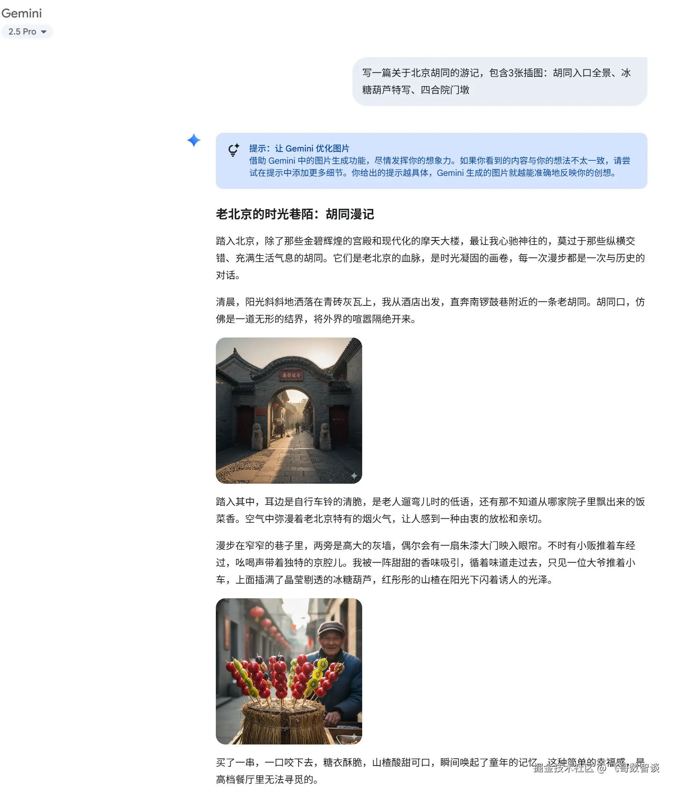

## 一、从纯文本到全模态：AI“感知系统”的代际跃迁

这部分可以帮学生建立“输入处理”在大模型应用中的全局认知。

首先指出一个核心事实：2026年的多模态大模型已经普遍采用**统一表示空间架构**，能够原生协同处理文本、图像、音频、视频，真正实现跨模态的理解、生成与交互，不再是“文本+图像”的简单拼接。

而国内也有重要突破——**百度文心5.0**正式版采用统一自回归架构作为原生全模态建模的基础框架，将文本、图像、音频、视频等异构数据统一处理；**美团开源的原生多模态大模型LongCat-Next**实现了三项关键技术突破，让AI能够像处理文字一样原生地理解物理世界的多模态信号。这也标志着多模态技术从“静态拼接”走向了“动态编排”——即从被动地将不同模态拼在一起，升级为根据任务需求智能地调度和组合模态输入。

### 全模态 vs 多模态 Omni!

- **Omni**potent adj. 全能的，无所不能的
- 在大模型领域，`Omni` 沿用了其“全部、全能”的含义，特指一类**原生多模态模型**。它不是简单地将处理不同信息类型的模型拼接在一起，而是从底层设计上就能无缝处理和理解文本、图像、音频、视频等多种信息形态的“全能型”AI。
- 可以说，`Omni`模型的目标是实现更像人类一样，通过“看、听、说、读”来综合感知和理解世界的AI。

- 多模态大模型的实现是针对不同模态输入，调用不同模型进行处理，然后将各种输出进行合并输出。
- 而“全模态大模型”则是模型本身原生支持了多种模态的输入和输出，从更加底层的维度进行了实现。

#### 几个例子

- 与全模态效果类似，但实现方式并不一致。豆包是通过调度算法等工程手段实现的。
  
- 挑选了一个我很久之前就在期望的场景，给出指令后，AI 可以直接给出图文并茂的结果
  

### 核心概念：原生全模态 (Native Omni-Modal)

`Omni` 模型的核心是“原生全模态”，这是一种全新的设计理念：

- **原生 (Native)**：模型在设计之初就将处理多模态信息的能力作为其“基因”，而非后期改造。
- **统一架构**：不同于传统方法将音频、图像和文本分别交给独立模型处理，`Omni` 模型采用统一的编码器和Transformer架构，在一个模型内部完成对所有信息的融合理解与生成。
- **原生输入/输出**：模型能够直接接收音频、视频等原始信号，并直接生成音频、文本等回答，无需依赖外部的语音识别或合成组件，从而大幅提升效率并降低延迟。

### 主要Omni模型概览

目前，全球多家公司和研究机构都在积极布局`Omni`模型领域。以下是部分代表性模型，它们共同构成了这个技术方向的前沿图景：

好的，已将原表合并为一栏，不再区分国内外，并精简了描述。以下是整合后的全模态（Omni）模型清单：

| 模型名称            | 开发机构  | 特点与意义                                                                                                 |
| :------------------ | :-------- | :--------------------------------------------------------------------------------------------------------- |
| **Nemotron 3 Omni** | NVIDIA    | 融合音视文理解与原生工具调用，赋能代理式AI应用构建。                                                       |
| **Claude Opus 4.5** | Anthropic | Claude 系列旗舰模型，支持图像与文本输入，在视觉分析、图表理解和长文本处理方面表现出色                      |
| **Gemini 3.1 pro**  | Google    | 原生多模态模型，统一架构原生处理文本、图像、音频、视频和代码，可处理1小时视频及8.4小时音频                 |
| **GPT-4o**          | OpenAI    | 首个端到端统一架构，以超低延迟实时音视频交互开启情感化全模态探索。                                         |
| **GPT-5.4**         | OpenAI    | 支持文本与图像输入，强调高级推理、编码、代理式工作流与原生电脑操作能力，剥离了原生音视频流的解析和生成能力 |
| **Kimi K2.5**       | 月之暗面  | 开源原生多模态模型，通过大规模混合预训练实现视觉和文本的深度整合，擅长跨模态推理和视觉智能体工具使用       |
| **Qwen3.5-Omni**    | 阿里通义  | 混合注意力MoE架构，113语种语音识别，215项任务SOTA，全球顶尖全模态大模型。                                  |
| **MiMo-V2-Omni**    | 小米      | 面向Agent时代，原生融合感知、工具调用与GUI操作，降低全模态智能体开发难度。                                 |
| **Kling 3.0 Omni**  | 快手      | 统一多模态视频生成架构，覆盖前期开发到后期视效的全流程AI生产力引擎。                                       |

## 二、OCR 3.0：从“看见字符”到“理解文档”

OCR部分可以紧扣一个核心趋势——大模型正在重塑文档处理的技术范式。

传统OCR只做“字符识别”，而**2026年的新一代文档智能模型正在经历从“OCR + 规则”到“VLM + LLM + 智能体”的代际跃迁**。

VLM（视觉语言模型）

具体来说，新一代OCR模型的演进趋势体现在三个层面：

- **端到端统一**：以百度**Qianfan-OCR**为例，这是一个40亿参数的端到端视觉语言模型，将文档解析、版面分析和文档理解统一在一个架构中，可以直接从文档图像生成结构化结果，实现了从“看见文档”到“理解文档”的一步直达。
- **轻量化高效**：**PaddleOCR-VL-1.5**以仅9亿参数的体量，在权威评测OmniDocBench v1.5上取得94.5%的整体精度，首次实现OCR领域的“异形框定位”能力，能精准识别倾斜、弯折、拍照畸变等非规则文档形态。
- **多任务整合**：一个模型同时支持OCR、公式识别、表格识别、图表识别、印章识别、文本检测等六大核心任务。

**代码示例**——建议现场演示用Python调用PaddleOCR做一次快速文档解析：

```python
from paddleocr import PaddleOCR
ocr = PaddleOCR(use_angle_cls=True, lang='ch')
result = ocr.ocr('contract.jpg', cls=True)
for line in result[0]:
    print(line[1][0])  # 输出识别文字
```

## 三、动态变量：从固定提示词到“上下文工程”

这部分可以将“动态变量”提升到更广阔的工程视角来讲。

提示变量是在创建时包含在提示的静态文本中、在运行时动态替换的占位符关键字。它的作用是将Prompt的固定结构与动态变量分离，建立可复用的模板。

**动态变量与多模态的实战结合示例**——以一个简历筛选Agent为例：

```python
prompt_template = """
你是一位招聘专家，请根据以下要求筛选候选人简历：
- 目标岗位：{{job_title}}
- 核心技能要求：{{required_skills}}

现在请评估以下简历PDF中的候选人是否匹配岗位：
（附加上传的PDF简历文件）
"""
```

当用户上传一份简历PDF并填写变量后，系统将模板与变量值组合成完整提示，连同PDF文档一起发给大模型。目前主流的AI模型均已支持多模态输入——**GPT-4o、Gemini 2.5、Claude Sonnet 4.5**等都可以在单次请求中处理图片、文档和文本。

在此基础上，可以进一步引出 **“上下文工程”** 的概念——从Prompt Engineering到Context Engineering的演进，意味着AI的输入不再只是一个简单的命令，而是一个动态、分层、可架构化的信息组件。**上下文工程的本质是通过动态构建和优化LLM推理时的信息负载（含查询、外部知识、历史对话等），提升系统的长期性能与效率**。

这背后还涉及**超长上下文处理**的关键挑战：Transformer自注意力机制的复杂度是O(n²)，将输入从4K tokens扩展到128K tokens，计算量会增加约122倍。这也是为什么即使模型支持长上下文（如Gemini 3支持1M tokens），工程上仍需要做分块处理和智能路由的优化。

**对学生的启发**：学Prompt工程只是第一步，从Context Engineering的高度去设计AI系统——比如如何管理多轮对话中的上下文压缩、如何将附件中的非文本信息（图表、表格）也纳入上下文中——才是构建生产级AI应用的关键。

## 动手实践推荐

建议给学生推荐以下实践方向，让分享“有得玩”：

1. **快速上手OCR**：用`pip install paddleocr`在5分钟内跑通第一个文档识别
2. **玩转多模态API**：调用OpenAI GPT-4o或Google Gemini API，上传一张白板照片让AI转成结构化笔记
3. **设计一个变量模板系统**：用Python写一个简单的Prompt模板引擎，实现`{{变量}}`替换功能
4. **进阶方向**：探索LangChain的PromptTemplate模块，或了解Agent系统中的动态上下文构建

## 五、拓展资源

- **PaddleOCR GitHub仓库**：最活跃的开源OCR项目，支持超100种语言，累计GitHub Star数已登顶全球OCR项目第一
- **NVIDIA多模态RAG Blueprint**：企业级多模态检索增强生成的参考架构，了解工业级实践
- **Qianfan-OCR模型论文**（arXiv:2603.13398）：了解端到端文档智能的前沿架构
